# Demystifying CuTe: Understanding Layout Algebra

*Part 1 of 2 — From conceptual foundations to efficient memory operations*

---

> **Series Overview:** This is the first of a two-part series on NVIDIA's CuTe (CUDA Template) library. In this post, we cover the fundamentals: layout algebra, the CuTe API, and how to build efficient copy operations. In [Part 2](CuTe%20Part%202%20-%20High-Performance%20GEMMs.md), we apply these concepts to build a GEMM kernel that outperforms cuBLAS on certain shapes.

---

**TL;DR:** CuTe is a way to arbitrarily partition a custom layout or tensor and write it in extremely concise terms. In this post we will understand how these Layouts work and build efficient copy kernels—the foundation for high-performance GPU algorithms.

<figure style="text-align: center;">
  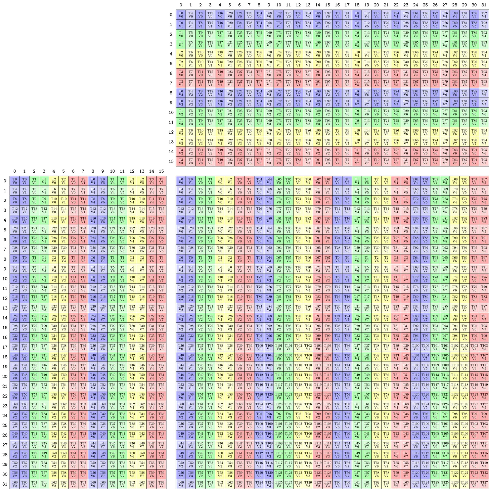
  <figcaption><em>Example layout of an SM80 type MMA operation in CuTe.</em></figcaption>
</figure>


*Disclaimer:* I don't try to replicate the NVIDIA documentation in this blogpost nor do I claim completeness. I want to show in a general way how CuTe layouts work and how they can be applied. For the really fancy algebra, I recommend doing your own exercises.

CuTe Layouts have been gaining more and more traction lately ([FA3](https://github.com/Dao-AILab/flash-attention), [CuTiles](https://docs.nvidia.com/cuda/cutile-python/), [CuTe](https://docs.nvidia.com/cutlass/latest/media/docs/cpp/cute/index.html)). I wanted to understand what makes these layouts seemingly loved by everyone and why NVIDIA is strongly pushing them. Gaining a first understanding was straightforward. However, intermediate blogposts beyond simple matrix algebra are missing. There is some code out there but it is rather advanced and stepwise guidance is missing. This blogpost aims at bridging this gap and by taking you along my learning journey.

## CuTe vs CUTLASS
CuTe is an extension introduced by CUTLASS 3.0. The layouts and their algebra is the key innovation of CuTe. This gives us programmers a new way to express tiling and match them with resources to compute our outputs. In kernels these match up and we can express this more easily in CuTe formats and thus write more readable code, which (1) is more maintainable and (2) helps us make fewer mistakes with indexing and coding our kernels.

Fundamentally, CuTe solves two problems:
1. **Indexing:** How we navigate multidimensional data.
2. **Mapping:** How we assign resources (threads, warps) to that data.

There are different levels of abstraction we can use when learning new things. This blogpost aims to abstract away as much as possible while still giving you as the programmer the most flexibility in designing your kernels. So we will not only use the high-level APIs of CUTLASS but use the low-level internal CuTe functions.

When to use CUTLASS?
If you have a standard linear algebra problem: use libraries like cuBLAS or cuDNN because they are heavily optimised. However, they do not provide the possibility to easily customise data movement or kernel fusion. While cuBLASLT gives some possibilities to fuse kernels, this is often not enough and you need lower level control. If you are implementing a novel architecture (e.g., a new attention variant or Mamba-like model) or a custom fused kernel, standard cuBLAS libraries often lack the specific optimisations you need.

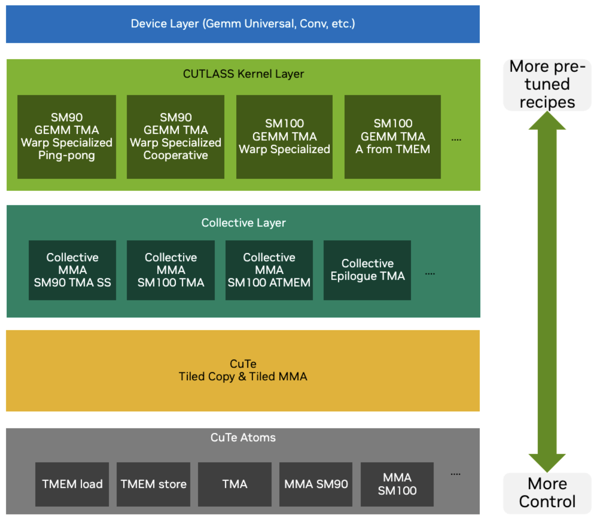
***Figure 1:** The NVIDIA programming stack from low level, which offer the most control, to higher abstraction, where operations are pre-truned. [Cris Cecka, GPUMode Lecture 57](https://github.com/gpu-mode/lectures/blob/main/lecture_057/CuTe%20-%20Copy%20for%20GPUMode.pdf)*

At its core, CUTLASS operates on **Tensors**. In the world of CuTe, a Tensor is simply a combination of two things:
1. **A Pointer:** Where the data lives in memory.
2. **A Layout:** How the data is organised.

The Layout is the star of the show here. A Layout consists of a *Shape* (logical dimensions) and a *Stride* (physical distance between elements). By manipulating these Layouts, we can describe complex tiling and partition patterns without rewriting our kernel code.

To speak the language of CuTe, we first need to understand its alphabet: the Types.

# CuTe Types 
[Type Docs](https://github.com/NVIDIA/cutlass/blob/main/media/docs/cpp/cute/01_layout.md#fundamental-types-and-concepts)
CuTe relies heavily on C++ template meta-programming to ensure zero-overhead abstractions. If you think about it, to describe layouts you need integers and some way to recursively nest them. That is why CuTe only needs the following types: Integers, Tuples (to group things together), IntTuples (for arbitrary recursive nesting).

**Integers** have two versions:
- Dynamic integers: Run-time values (`int`, `size_t`, etc.) - standard C++ integral types, or
- Static integers: Compile-time constants (`cute::C<Value>` or `Int<1>`, `_1`, etc.), which all mean the same and are encoded as `static constexpr`.

**Tuples** are defined as a finite ordered list of zero or more elements, aka the CUDA-compatible version of `std::tuple`, which works on device and host with simplified set of instructions. 

CuTe defines the **IntTuple** concept as either an integer, or a tuple of IntTuples. So you get the option of arbitrary recursive nesting. For example these are all IntTuples: `2`, `Int<3>{}`, `(2,3)`, `(42,(1,3),17)`.
IntTuples support essential operations like:
- `rank()`: Number of elements (integer = 1, tuple = its size)
- `get<I>()`: Access I-th element
- `depth()`: Hierarchical levels (integer = 0, increases with nesting)
- `size()`: Product of all elements

In CuTe IntTuples represent everything from Shape, Stride, Step to Coordinates.

# CuTe Layouts 
[Docs](https://github.com/NVIDIA/cutlass/blob/main/media/docs/cpp/cute/01_layout.md#layout-creation-and-use)
Now we can formalise the definition of layouts. Since both `Shape` and `Stride` are `IntTuple` concepts, we can combine them.

A **`Layout`** is a tuple of `(Shape, Stride)`. Semantically, a Layout is a **function** that maps a logical **Coordinate** to a physical **Index** (offset).

A `Layout` can be composed with data, e.g., a pointer or an array, to create a **`Tensor`**. The index generated by the `Layout` is used to subscript an iterator to retrieve the appropriate data. 

To index a position $(i,j)$ in our data we can think of the easiest example of a col-major matrix of size $M\times N$ then the position in memory is $\text{index} = i + j \times M$, where $i$ is the row index (ranging from $0$ to $m-1$) and $j$ is the column index (ranging from $0$ to $n-1$). The 3D case would then be 
$$(i,j,k) \mapsto i + j\times M + k \times M\times N$$
and the allowed coordinates are $i,j,k \in [0,M-1] \times [0,N-1] \times [0,K-1]$.

So we can think of this mapping from position indices to memory index as an *inner product* $(i,j,k) \cdot (1, M, MN)$. Now the second vector can be thought of as the *stride* and the size of each dimension as the *shape* $(M, N, K)$. CuTe writes these layouts in the format
$$
\underbrace{(M,N,K)}_{shape}: \underbrace{(1, M, MN)}_{stride}
$$
This generalises so $\text{idx} = \text{inner\_product}(\text{coord},\text{stride})$.

Let's recap: the first part of the layout is the allowed inputs while the second part describes how to get from coordinates to memory offsets. We can think of the stride in each direction as by how much one step increases the offset. So for example $(4,3):(3,1)$ gives the matrix in the top left corner of Figure 2.

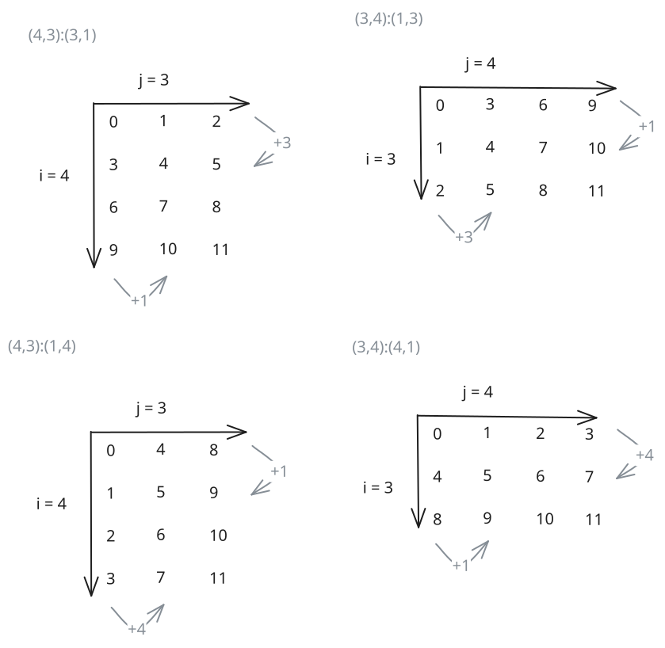
***Figure 2:** CuTe layouts and indexing patterns of both column and row major 4x3 and their transpose 3x4 matrices.*

Now we can check what the transpose looks like. For the transpose matrix, we need to swap both the shape and the stride on the axis we transpose over as shown in the top right corner of Figure 2. For completeness the lower row in the same Figure shows the same shape as the top row just with opposite striding pattern. Note here that the larger stride changes from $N$ to $M$.

CuTe lets us define two default striding patterns 
- `LayoutLeft`: $(a,b,c,d):(1,a,ab,abc)$, which has the first shape as fastest changing. So this is just a generalised column-major
- `LayoutRight`: $(a,b,c,d):(bcd,cd,d,1)$, is the opposite LayoutLeft and this a generalised row-major.

Okay this so far is intuitive. But CuTe also allows us to nest these layouts and that's where the expressiveness is coming from. If we want to nest structures (for instance $((M_m, M_n),N):((a,b), M)$), then the coordinates, should have the same nesting, which in CuTe is called `congruent`. 

The simplest way to use nested layouts would be to create tiles all of the same striding pattern. Let's start off with an example of a larger matrix T which has a smaller subtile illustrated in Figure 3.

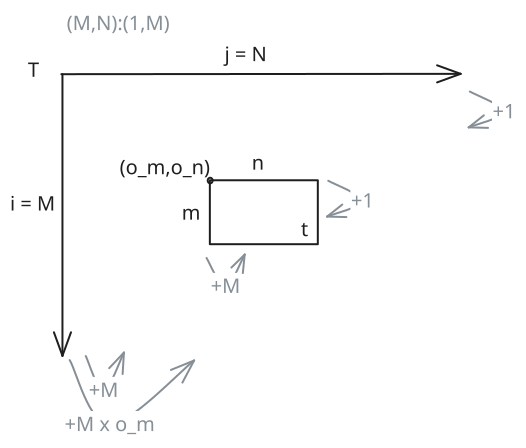
***Figure 3:** Example of a tiled matrix. Inspired by [Eric Auld's GPUMode Lecture 15](https://www.youtube.com/watch?v=G6q719ck7ww).*

We can observe, that the tensor of the smaller tile has the same striding pattern but just different shapes and starting pointer (the offset $(o_m,o_n)$ which is offset $o_m + o_n \times M$) $Layout(T) = (M,N):(1,M)$ and $Layout(t) = (m,n):(1,M)$. 

Since we can view layouts as functions mapping coordinates to offsets, we can compose them to describe the entire tiled tensor $T_{tiled} = T \circ t$. But what does that resulting layout look like? Let's derive it step by step.
The key idea is that each original dimension gets split into two sub-dimensions: one for the position within a tile, and one for which tile we're in.

To make sense of this layout, think for the shape $(2,2)$ as $((2,1),(2,1))$ (1 tile of size 2), so of going from low level to higher level abstraction.
Consider the row dimension. Originally we have $M$ rows. After tiling with tiles of height $m$:
- Within-tile coordinate ($i_{in}$): ranges over $\{0, \ldots, m-1\}$, with the same stride as before: $1$
- Which-tile coordinate ($i_{tile}$): ranges over $\{0, \ldots, \frac{M}{m}-1\}$. Jumping from one tile to the next skips $m$ rows, so the stride is $m \times 1 = m$

The same logic applies to the column dimension ($N$ columns, tiles of width $n$):
- Within-tile coordinate ($j_{in}$): ranges over $\{0, \ldots, n-1\}$, stride stays $M$
- Which-tile coordinate ($j_{tile}$): ranges over $\{0, \ldots, \frac{N}{n}-1\}$, stride is $n \times M = M \times n$
Putting it together, the tiled layout is:

$$Layout(T_{tiled}) = \left(\underbrace{(m,\frac{M}{m})}_\text{row: (in-tile, which-tile)},\underbrace{(n,\frac{N}{n})}_\text{col: (in-tile, which-tile)}\right):\left(\underbrace{(1,m)}_\text{row strides},\underbrace{(M, M\times n)}_\text{col strides}\right)$$

The offset formula then becomes $\text{offset} = i_{in} \times 1 + i_{tile} \times m + j_{in} \times M + j_{tile} \times M \times n$.

Note here that $((m,n),(j,k)):((a,b),(c,d))$ produces the same indexing patterns as layout $(m,n,j,k):(a,b,c,d)$.

We can create an example of tiling $(6,20):(20,1)$ with tiles of shape $(2,4)$, so we get 3 tiles in the $i$-direction and 5 tiles in the $j$-direction. In memory the values should be laid out column-major.

In CuTe, this tiling operation corresponds to the logical division operator $\oslash$. Let's shift from thinking about "dimensions" to "modes". A shape is defined as $(mode_0, mode_1)$, where any $mode_x$ can be further split.

Logical division creates a new shape where the first mode is the divisor. Thus:
*   The **first mode** indicates which item in the tile we are accessing.
*   The **second mode** selects the tile itself.
This preserves the ordering from deep (inner) to high-level (outer).

$$(A,B,C) \oslash (a,b,c) = ((a,b,c),(A/a,B/b,C/c))$$

If the divisor does not divide all modes, we treat the missing modes as $1$. The tiler is matched positionally: tiler entry 0 divides layout mode 0, tiler entry 1 divides layout mode 1, and so on. Any layout modes beyond the tiler's rank are left undivided.
For instance, $(a,b)$ is treated as $(a,b,1)$. If you actually wanted to skip mode-1 and divide only modes 0 and 2, you'd need to explicitly pass a placeholder like `<a, _, c>`.
Consequently, the "missing" modes remain in the second part of the result:
$$(A,B,C) \oslash (a,b) = ((a,b),(A/a,B/b,C))$$.

**What about strides?**
Suppose we have a layout $(A,B,C):(1,A,AB)$ and divide it by $(a,b,c)$. What is the resulting layout?
$$(A,B,C):(1,A,AB) \oslash (a,b,c) = \left(\underbrace{(a,b,c):S_{tile}}_\text{tile}, \underbrace{(A/a,B/b,C/c):S_{outer}}_\text{outer}\right)$$

As established, the stride inside the tile ($S_{tile}$) remains the same as the initial tensor.
The outer stride ($S_{outer}$) is also based on the original stride, but the indices move by a factor of the tile size $(a,b,c)$.
Therefore, the new layout becomes:
$$\begin{aligned}
&\left(\underbrace{(a,b,c):(1,A,AB)}_\text{tile},  \underbrace{(A/a,B/b,C/c):(a,Ab, ABc)}_\text{outer}\right) \\
&= ((a,b,c),(A/a,B/b,C/c)):((1,A,AB),(a,Ab, ABc))
\end{aligned}$$

Now that we understand tiling, let's look at another fundamental operation: composition.
# CuTe Layout Compositions
Another important algebraic operation is layout composition. The composition $A \circ B \mapsto R$ can be seen as first applying layout B followed by layout A $R(c) = A(B(C))$. Note here that the layout of R needs to be of the same shape as B, so it needs to be *compatible*.
What is defined rather simply can get very tedious in practice. But let's first introduce some rules.
1. Left and right identities: $I\circ B = B$ and $A\circ I = A$
2. Associative: $(A\circ B) \circ C = A\circ (B \circ C )$
3. Left Distributive: $A\circ B=A\circ (B_1,B_2)=(A\circ B_1,A\circ B_2)$

When should you use a composition? For instance, you have an access pattern (B), which you need to apply on an input tensor. This input tensor might have a some strange access pattern itself (let's say only take every second element). Then the composition lets you use the optimal access pattern B defined before, on every input tensor without needing to express the super complex resulting indexing pattern explicitly.

A common use case is swizzling, where we want to permute the layout to avoid bank conflicts (more on this in the Section Examples). We can define a swizzle transform separately and apply it to the layout. In code this can look like the following:
```cpp
// Swizzled shared memory layout
auto sA = composition(
    Swizzle<2,3,3>{},                               // the swizzle transform
    make_layout(make_shape(Int<BM>{}, Int<BK>{}),   // the base (row-major) layout
                make_stride(Int<BK>{}, Int<1>{}))
);
```
This swizzle example is taken from Section Example::Copying::Swizzle further down in this document and explained there.

Given this layout algebra, let's take a look at the CuTe API and how we can use these layouts.

# CuTe API
For reasons of completeness here is a summary of the key APIs of CuTe found in `cute/layout.hpp` and `cute/tensor.hpp`.

The CuTe API is broadly organized into logical groups:
*   Layouts: Functions to define the coordinate-to-index mappings.
*   Layout Algebra: Functions to perform operations on layouts.
*   Tensors: Wrappers that combine a pointer with a layout.
*   Algorithms: High-level operations (like `copy`, `gemm`) that accept tensors and handle the underlying looping logic.
*   MMA/Copy Atoms: Primitives for matrix multiplication and data movement and their CuTe layouts. Algorithms can accept these atoms as arguments.

| Category            | Function / Macro                    | Description                                               |
| ------------------- | ----------------------------------- | --------------------------------------------------------- |
| **Layout Creation** | `make_shape(...)`                   | Creates a `Shape` tuple (can be nested).                  |
|                     | `make_stride(...)`                  | Creates a `Stride` tuple.                                 |
|                     | `make_layout(shape)`                | Creates a compact column-major layout.                    |
|                     | `make_layout(shape, stride)`        | Creates a layout with explicit strides.                   |
|                     | `make_layout(shape, LayoutRight)`   | Creates a compact row-major layout.                       |
|                     | `make_ordered_layout(shape, order)` | Creates a layout with a specific order.                   |
|                     | `make_layout_like(layout)`          | Creates a layout with the same structure as another.      |
|                     | `make_identity_layout(shape)`       | Creates a layout mapping coordinates to themselves.       |
| **Tensor Creation** | `make_tensor(ptr, layout)`          | Creates a tensor view from a pointer.                     |
|                     | `make_tensor(ptr, shape, stride)`   | Convenience wrapper for tensor creation.                  |
|                     | `make_tensor<T>(layout)`            | Creates an owning tensor (allocates storage).             |
|                     | `make_tensor_like(tensor)`          | Creates a register tensor with same layout as input.      |
|                     | `make_fragment_like(tensor)`        | Creates a register fragment (often for MMA accumulators). |
|                     | `make_identity_tensor(shape)`       | Creates a tensor mapping coordinates to themselves.       |
| **Pointers**        | `make_gmem_ptr(ptr)`                | Wraps a pointer as Global Memory.                         |
|                     | `make_smem_ptr(ptr)`                | Wraps a pointer as Shared Memory.                         |
| **Layout Ops**      | `layout(coord)`                     | Maps a coordinate to an index (or sub-layout).            |
|                     | `slice(coord, layout)`              | Returns a sub-layout by slicing.                          |
|                     | `dice(coord, layout)`               | Returns a sub-layout by dicing.                           |
|                     | `flatten(layout)`                   | Flattens a hierarchical layout to 1D.                     |
|                     | `coalesce(layout)`                  | Merges contiguous dimensions.                             |
|                     | `composition(layoutA, layoutB)`     | Composes two layouts ($A \circ B$).                       |
|                     | `tile(layout, tile_layout)`         | Tiles a layout.                                           |
|                     | `size(layout)`                      | Returns the total size (elements).                        |
|                     | `rank(layout)`                      | Returns the rank (number of modes).                       |
| **Tensor Ops**      | `tensor(coord)`                     | Accesses an element or sub-tensor.                        |
|                     | `local_tile(tensor, tile, ...)`     | Tiles a tensor for CTA/Thread partitioning.               |
|                     | `local_partition(tensor, ...)`      | Partitions a tensor.                                      |
|                     | `recast<T>(tensor)`                 | Recasts tensor elements to type `T`.                      |
| **Algorithms**      | `copy(copy_atom, src, dst)`         | Copies data (handles tiling/partitioning).                |
|                     | `gemm(mma_atom, A, B, C)`           | Performs Matrix Multiply Accumulate.                      |
|                     | `axpby(alpha, A, beta, B)`          | Performs $B = \alpha A + \beta B$.                        |
|                     | `fill(tensor, value)`               | Fills a tensor with a value.                              |
|                     | `clear(tensor)`                     | Clears a tensor (sets to zero).                           |
|                     | `print(tensor)`                     | Prints tensor structure/data (host/device).               |
| **MMA/Copy**        | `make_tiled_copy(...)`              | Creates a TiledCopy for data movement.                    |
|                     | `make_tiled_mma(...)`               | Creates a TiledMMA for matrix multiplication.             |
|                     | `partition_S(tensor)`               | Partitions source tensor for copy.                        |
|                     | `partition_D(tensor)`               | Partitions destination tensor for copy.                   |
|                     | `partition_fragment_A/B(tensor)`    | Partitions A/B for MMA.                                   |
***Table 1:** Key API of CuTe in C++.* 

While the list is extensive, the core workflow revolves heavily around "Layout Creation" and "Layout Ops".
*   `make_layout(shape, stride)`: The fundamental constructor we use to define the initial structure of our data.
*   `tile(layout, tile_layout)`: Corresponds to the tiling operator we discussed, allowing us to nest layouts.
*   `composition(A, B)`: Corresponds to the $A \circ B$ operator we discussed, allowing us to chain layout transformations.

These operations are designed to be composable. You typically start by creating a base layout with `make_layout`, and then refine it using operations like `tile` (logical division) or `composition` to match the hierarchy of your hardware (e.g., tiling for warps or shared memory banks).

Now that we know the API, let's see how CuTe uses these abstractions to implement algorithms.
# Generic Algorithms
At their core, CuTe algorithms are generic templates. For example, one can copy by simply iterating over the tensor and copying from source to destination:
```c
copy(Tensor const& src, Tensor& dst){
    for (int i=0; i< size(dst); i++){
        dst(i) = src(i);
    }
}
```
*Note*, that if the shapes are known at compile time (which is common as we often use fixed tilings), then the loops can be unrolled and offsets can be computed statically, rendering the copy operations optimal.


This can also be simplified to copy a full tensor using the `copy` algorithm.
```c
copy(Tensor const& src, Tensor& dst){
    copy(src, dst);
}
```

Actually, with copying you can create much more than just copying. You can also transpose, aggregate or cast information.
For instance broadcasting can be thought of as a copy from a layout which indices always to position 0 to a layout with stride >=1. More ideas can be gained from the table below.

| **Applications** | **Source** | **Destination** |
| --- | --- | --- |
| 1D Arrays | 8:1 | 8:1 |
| ND Arrays | (8,2,3):(1,8,16) | (8,2,3):(1,8,16) |
| GATHER | (2,2,2):(42,1,128) | 8:1 |
| SCATTER | 8:1 | (2,2,2):(42,1,128) |
| BROADCAST | 8:0 | 8:1 |
| CONSTANT | 8:0 | 8:0 |
| TRANSPOSE | (8,3):(1,8) | (8,3):(3,1) |
***Table 2:** By varying the input and output layouts, the copy instruction is able to perform more than a simple direct copy. [Cris Cecka, GPUMode Lecture 57](https://github.com/gpu-mode/lectures/blob/main/lecture_057/CuTe%20-%20Copy%20for%20GPUMode.pdf)*


For GEMMs we can again go very similarly simple. For instance for a rank 3 tensor, the code would look something like this
```c
gemm(Tensor const& A, Tensor const& B, Tensor& C){
    for (int i=0; i< size(dst); i++){
        for (int j=0; j< size(dst); j++){
            for (int k=0; k< size(dst); k++){
                C(j,k) += A(j,i) * B(k,i);
    }}}
}
```
And again by varying the shapes and strides a simple GEMM can implement different algorithms, including convolutions as shown in Figure 4.
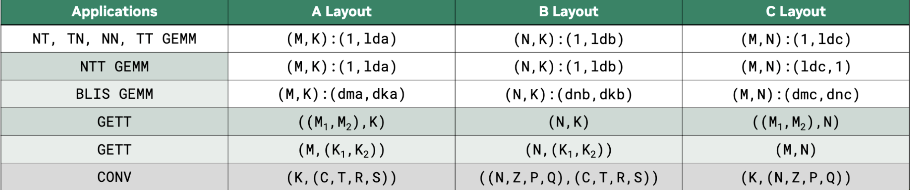
***Figure 4:** By varying the input and output layouts, the matrix multiplication instruction is able to perform more than a simple direct MMA operation. [Cris Cecka, GPUMode Lecture 57](https://github.com/gpu-mode/lectures/blob/main/lecture_057/CuTe%20-%20Copy%20for%20GPUMode.pdf)*

# Hardware Acceleration with Atoms
While these generic loops work for any layout, they don't exploit the specialised hardware instructions (like Tensor Cores, Vectorised or Async Copy or TMAs) required for peak performance. To bridge the gap between logical layouts and hardware instructions, CuTe introduces **Atoms**.

## Copying Atom
As shown before, in CuTe one can use the copy function to move data from one tensor to another `copy(Tensor A, Tensor B)`. To be more specific on how this data is copied one can add a description. In CuTe, [`TiledCopy`](https://docs.nvidia.com/cutlass/media/docs/pythonDSL/cute_dsl_api/cute.html#cutlass.cute.TiledCopy) is a compile-time description of how threads cooperatively copy a tile of data between memory spaces (e.g., global → shared, or shared → registers). It defines who copies what. Let's explain the details at an example:
```c
TiledCopy copyA = make_tiled_copy(
    Copy_Atom<AutoVectorizingCopy, bf16>{},   // what operation each thread performs (the atom)
    Layout<Shape<_4,_8>,Stride<_8,_1>>{},     // thread layout: 4 x 8 threads = 32 threads (warp)
    Layout<Shape<_1,_8>>{}                    // per-thread tile shape: each thread copies 1 x 8 elements
);
```
The first argument declares that each atomic copy operation (done by one thread) copies bf16 elements using vector instructions and assuming 128 byte alignment. Further copy instructions can be found under `cutlass/include/cute/arch/copy.hpp`.
The second argument defines the thread layout (i.e., how threads are arranged logically when cooperating on a tile) while the last argument declares the per-thread copy tile shape (i.e., how many elements each thread copies). 
So in this example we have a 4×8 thread tile (one warp) where the threads are organised row-major. Each thread copies 1 row × 8 contiguous columns. That means the entire warp copies a 4×64 BF16 tile from one memory space to another.

A full list of copy atoms can be found in the table below.

| Architecture | Copy Atom | Description |
| :--- | :--- | :--- |
| **Generic** | `UniversalCopy<S, D>` | Direct copy (assignment). |
| | `AutoVectorizingCopy` | Auto-vectorized copy (assumes 128-bit alignment). |
| | `DefaultCopy` | Default copy (no alignment assumption). |
| **SM50** | `SM50_Shuffle_U32_2x2Trans_XOR1` | Warp shuffle (XOR 1). |
| | `SM50_Shuffle_U32_2x2Trans_XOR4` | Warp shuffle (XOR 4). |
| **SM75 (Turing)** | `SM75_U32x1_LDSM_N` | `ldmatrix` (Load Shared Matrix), 1x32-bit. |
| | `SM75_U32x2_LDSM_N` | `ldmatrix`, 2x32-bit. |
| | `SM75_U32x4_LDSM_N` | `ldmatrix`, 4x32-bit. |
| | `SM75_U16x2_LDSM_T` | `ldmatrix` Transposed, 2x16-bit. |
| | `SM75_U16x4_LDSM_T` | `ldmatrix` Transposed, 4x16-bit. |
| | `SM75_U16x8_LDSM_T` | `ldmatrix` Transposed, 8x16-bit. |
| | `SM75_U32x1_MOVM_T` | `movmatrix` (Move Matrix Transposed). |
| **SM80 (Ampere)** | `SM80_CP_ASYNC_CACHEALWAYS` | `cp.async` (Global -> Shared), Cache Always (L2). |
| | `SM80_CP_ASYNC_CACHEGLOBAL` | `cp.async` (Global -> Shared), Cache Global (Bypass L1). |
| | `SM80_CP_ASYNC_CACHEALWAYS_ZFILL` | `cp.async` with zero-fill predicate. |
| | `SM80_CP_ASYNC_CACHEGLOBAL_ZFILL` | `cp.async` with zero-fill predicate. |
| **SM90 (Hopper)** | `SM90_U32x1_STSM_N` | `stmatrix` (Store Shared Matrix), 1x32-bit. |
| | `SM90_U32x2_STSM_N` | `stmatrix`, 2x32-bit. |
| | `SM90_U32x4_STSM_N` | `stmatrix`, 4x32-bit. |
| | `SM90_U16x2_STSM_T` | `stmatrix` Transposed, 2x16-bit. |
| | `SM90_U16x4_STSM_T` | `stmatrix` Transposed, 4x16-bit. |
| | `SM90_U16x8_STSM_T` | `stmatrix` Transposed, 8x16-bit. |
| | `SM90_TMA_LOAD` | TMA Load (Global -> Shared). |
| | `SM90_TMA_LOAD_IM2COL` | TMA Load with Im2Col transformation. |
| | `SM90_TMA_LOAD_MULTICAST` | TMA Load with Multicast. |
| | `SM90_TMA_STORE` | TMA Store (Shared -> Global). |
| | `SM90_TMA_REDUCE_ADD` | TMA Reduce Add. |
| | `SM90_BULK_COPY_G2S` | Bulk Copy (Global -> Shared). |
| | `SM90_BULK_COPY_S2G` | Bulk Copy (Shared -> Global). |
| **SM100 (Blackwell)** | `SM100_TMA_2SM_LOAD` | TMA Load to 2SM. |
| | `SM100_TMEM_LOAD` | TMEM Load. |
| | `SM100_TMEM_STORE` | TMEM Store. |
***Table 3:** Key copy instructions of CuTe in C++.* 

Given we can copy efficiently we also want to compute efficiently with tensor core operations.
## MMA Atoms
An example is the Volta FP16 16x8x8 MMA tensor core instruction, which can be laid out using CuTe shapes as shown in Figure 5. 

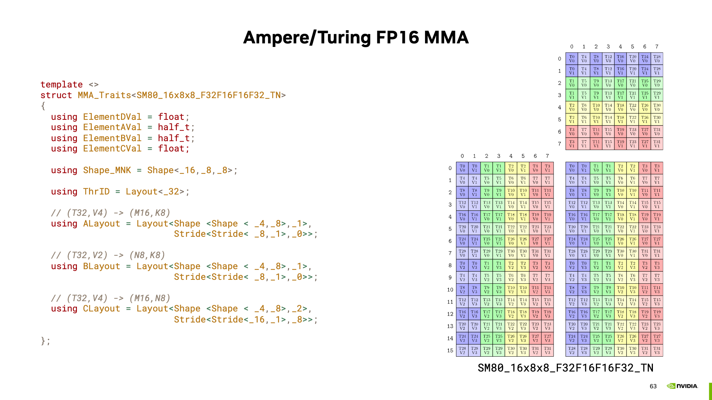
***Figure 5:** R.h.s: illustration of the Volta SM80 16x8x8 MMA tensor core instruction with the corresponding C++ template on the l.h.s. [Cris Cecka, GPUMode Lecture 57](https://github.com/gpu-mode/lectures/blob/main/lecture_057/CuTe%20-%20Copy%20for%20GPUMode.pdf)*

Now this can be extended to any other hardware unit. Combining these operations with the traits (the meta info) creates a so-called MMA Atom. With the MMA atom we can print these nice pictures using 
```c
MMA_Atom mma = MMA_Atom<SM90_16x8x4_F64F64F64F64_TN>{};
print_latex(mma)
```
and even type check our input matrices.

It would not be a cute layout if these atoms could not be extended. Using `TiledMMA`, we can generate repeated atom shapes and optionally also use different striding for these tensor core operations, potentially helping us with shared memory access patterns.

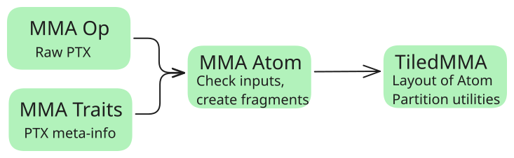
***Figure 6:** MMA atoms are a combination of MMA operations (the PTX instruction) and their traits (aka what input shapes they require). The TiledMMA builds upon MMA atoms by nesting them, allowing for arbitrary MMA operations to be performed. Inspired by [Cris Cecka's GPUMode Lecture 57](https://github.com/gpu-mode/lectures/blob/main/lecture_057/CuTe%20-%20Copy%20for%20GPUMode.pdf).*

A typical CuTe GEMM kernel has three phases: (1) partition work among threads, (2) copy data to shared memory, (3) compute using MMA. Here's the main loop structure; each thread can get its memory tiles using
```c
ThrMMA thr_mma = tiled_mma.get_slice(threadIdx.x);
```
Then this can be used to execute the MMA from each thread. The main GEMM loop using MMAs in CuTe would look something like the following.
```c
// Partition the threads by telling which thread moves what
// [...]
for (int k = 0; k < (K + BK - 1) / BK; k += 1) { // 
// Async copy from global to shared
copy(copyA, tAgA(_,_,_,k), tAsA);
copy(copyB, tBgB(_,_,_,k), tBsB);

// [...]
// Load fragments from shared memory to registers
copy(copyS2R_A, tXsA, tXrA);
copy(copyS2R_B, tXsB, tXrB);

// MMA operation
gemm(mma, tCrA, tCrB, tCrC);
// [...]
}
```

In Table 4 below, there's a partial list of MMA atoms. Based on the patterns you can see, the MMA atom is defined by the tile shape and the quantization of the inputs and outputs.

| Architecture | MMA Atom | Description |
| :--- | :--- | :--- |
| **Generic / Legacy** | `SM61_DP2A` | DP2A (Dot Product 2 Accumulate). |
| | `SM61_DP4A` | DP4A (Dot Product 4 Accumulate). |
| **SM70 (Volta)** | `SM70_8x8x4_F16F16F16F16_TN` | Tensor Core, FP16 Accumulate. |
| | `SM70_8x8x4_F32F16F16F32_TN` | Tensor Core, FP32 Accumulate. |
| **SM75 (Turing)** | `SM75_16x8x8_F32F16F16F32_TN` | Tensor Core, FP16 Input, FP32 Accumulate. |
| | `SM75_8x8x16_S32S8S8S32_TN` | Tensor Core, Int8 Input, Int32 Accumulate. |
| **SM80 (Ampere)** | `SM80_16x8x8_F16F16F16F16_TN` | Tensor Core, FP16 Accumulate. |
| | `SM80_16x8x8_F32F16F16F32_TN` | Tensor Core, FP16 Input, FP32 Accumulate. |
| | `SM80_16x8x8_F32BF16BF16F32_TN` | Tensor Core, BF16 Input, FP32 Accumulate. |
| | `SM80_16x8x8_F32TF32TF32F32_TN` | Tensor Core, TF32 Input, FP32 Accumulate. |
| | `SM80_16x8x16_S32S8S8S32_TN` | Tensor Core, Int8 Input, Int32 Accumulate. |
| | `SM80_16x8x32_S32S4S4S32_TN` | Tensor Core, Int4 Input, Int32 Accumulate. |
| | `SM80_8x8x4_F64F64F64F64_TN` | Tensor Core, FP64 Input, FP64 Accumulate. |
| **SM89 (Ada)** | `SM89_16x8x32_F32E4M3E4M3F32_TN` | Tensor Core, FP8 (E4M3) Input, FP32 Accumulate. |
| | `SM89_16x8x32_F32E5M2E5M2F32_TN` | Tensor Core, FP8 (E5M2) Input, FP32 Accumulate. |
| **SM90 (Hopper)** | `SM90::MMA_16x8x16_F64F64F64F64_TN` | Tensor Core, FP64 Input, FP64 Accumulate. |
| | `SM90::GMMA::MMA_64x128x16_F16F16F16_SS` | WGMMA (Warpgroup MMA), FP16 Input/Accumulate. |
| | `SM90::GMMA::MMA_64x128x32_F16E4M3E4M3_SS_TN` | WGMMA, FP8 Input, FP16 Accumulate. |
| **SM100 (Blackwell)** | `SM100_MMA_TF32_SS` | UMMA (Unified MMA), TF32 Input. |
| | `SM100_MMA_F16BF16_SS` | UMMA, FP16/BF16 Input. |
| | `SM100_MMA_S8_SS` | UMMA, Int8 Input. |
| | `SM100_MMA_F16BF16_2x1SM_SS` | UMMA, 2x1 SM Cluster. |
***Table 4:** Key mma instructions of CuTe in C++.* 

With all this information we can now start to write kernels. Let's see some examples.

# Examples
There are some examples on how CuTe can be used in the CUTLASS repo under `cutlass/examples/cute`. However, these examples are rather elaborate so in the following Sections, we gradually build up to the full GEMM example. My examples were coded for an A100 (80GB). As we will see updating these kernel to use Hopper or Blackwell instructions is much simpler than in legacy CUDA code.
As we know for GEMMs on modern GPUs we want to use Tensor Cores and those are very hungry. Therefore, the general idea of any GEMM kernel is to keep the TCs (Tensor Cores) happy and well-fed. So efficient copying is important. Let's take a look at how copying with CuTe templates can facilitate easy experimentations.

All examples can be found in full in this [repo](https://github.com/ericschreiber/DrowsyHummingbird). The goal of these examples is not the get to peak performance but rather explain how CuTe layout can be used and show when they are helpful for interpretation. I try to get the kernels as fast as possible, given some reasonable constraints (no block size optimisation; it is still just a demo but I assume `128x128x64` should work rather well; nicely aligned and sufficiently large matrices).

***Historical Note:** You will often see CuTe refer to threadblocks as CTAs (Cooperative Thread Arrays). This is the CUDA term for a threadblock.*

### Copying 
To build up to our GEMM example, we need to move tiles into smem and back to global memory. Later we will use the tile shapes of `m128n128k64`. Thus the examples in this chapter show how to move the tiles in matrix $A$, of shape $128\times64$ (`BF16`), into shared memory and back to global.

#### General Setup
CuTe's approach to describing the problem to compute mapping is global, which contrasts with the local perspective known from CUDA. The idea behind this programming mode is to declare the whole problem layout first, tile it into CTA's, which are mapped to thread-blocks in CUDA's programming model, and lastly operate inside these tiled partitions.
For our copy example the matrix to copy is laid out in memory in row-major fashion, so iterating over $K$ moves fastest.
```c
// Problem shape and strides
auto prob_shape = make_shape(M, K);
auto dA = make_stride(K, Int<1>{}); 
```
Then we define the thread block sizes we want to be operating on. Note here that `Int<...>{}` are static types, computed at compile time and thus reduce runtime. Using static types here, is only possible because `BM` and `BK` are constant expressions.
```c
// Block tiling sizes
auto cta_tiler = make_shape(Int<BM>{}, Int<BK>{});
```
Lastly, before launching the kernel we can already define the layout of the shared memory tile we will be using.
```c
// Create shared memory layouts
auto sA = make_layout(make_shape(Int<BM>{}, Int<BK>{}), make_stride(Int<BK>{}, Int<1>{}));
```
For now let's keep the tiles the same shape as the copies we want to perform thus `BM= 128 & BK=64`.

Launching the kernel remains the same as in standard CUDA. The argument `copyA` is of type `TiledCopy` and describes how the threads should partake in the copy operation. Each kernel defines these slightly different. We'll skip this here and show the descriptions in the following Subsections.
```c
kernelCuteBasicCopy<<<dimGrid, dimBlock, smem_bytes>>>(
        prob_shape,
        cta_tiler,
        In, dA, sA, copyA,
        Out, M, K
      );
```
Inside each copy kernel we perform three steps:
1. Define SMem and GMem tensors.
2. Get a local tile for each thread block to operate on.
3. Copy from GMem to SMem and back

First we create the needed shared memory and a CuTe tensor describing it. We use here the layout defined in our CPU code. Tensors are also created for the input and output GMem matrices. To show another way of initializing the tensors, the shapes and strides are not first contained in a layout. Both ways are allowed.
```c
// Create SMem tensor
int smem_a_elems = int(size(a_smem_layout));
extern __shared__ bf16 smem[];
Tensor sA = make_tensor(make_smem_ptr<bf16>(smem), a_smem_layout);

// Create a tensor view of global memory A
Tensor gIn = make_tensor(make_gmem_ptr(In), make_shape(M, K), a_stride);
Tensor gOut = make_tensor(make_gmem_ptr(Out), make_shape(M, K), a_stride);
```

Next we get the memory tile our thread block operates on 
```c
// Define the tile to copy (use the shared-memory layout's shape)
auto tile_shape = shape(a_smem_layout);
auto gIn_tile = local_tile(gIn, tile_shape, make_coord(blockIdx.x, blockIdx.y));
auto gOut_tile = local_tile(gOut, tile_shape, make_coord(blockIdx.x, blockIdx.y));
```
Note here that you can get the shape of a layout with `shape(a_smem_layout);` and the same goes for the stride `stride(a_smem_layout);`, making the layouts quite useful to declare your problem in full.

Lastly we perform the copy operations using again the declarative copy instruction `copyA`. The `copy()` function can also be used without a declarative copy instruction but then falls back to basic copy instructions.
```c
// Copy global memory A → shared memory sA using CuTe copy
copy(copyA, gIn_tile, sA);
__syncthreads();

copy(copyA, sA, gOut_tile); // Copy back to global memory for verification
__syncthreads();
```

You can see this kernel is simplified quite significantly, as we don't have to care about the indexing into the memory arrays, removing a necessary step which is prone to mistakes. The magic lies in the `TiledCopy` instruction, with which one defines how the threads map to the values and which copy instruction is being used. Thus we can steer how the copy should be performed. A tiled copy has the form
```c
TiledCopy copyA = make_tiled_copy(
        Copy_Atom,                // Copy Atom
        Layout,                   // Thread Layout
        Layout);                  // Value Layout
```
where the `Copy_Atom` declares which instruction should be used. An example would be `Copy_Atom<DefaultCopy, bf16>{}` for copying single BF16 values one by one. 
The thread layout declares how the threads should map to the memory layout and how many take part in the copy instruction. `Layout<Shape<_16, _2>, Stride<_2, _1>>{}` for instance uses a full warp with 16 threads mapping to the `M`-direction and 2 threads, per `M`-direction, mapping to the `K`-direction. Since, the striding is again row-major threads 0 and 1 operator on the indices $(0,0)$ and $(0,1)$ respectively, thread 2 on $(1,0)$ and so forth.
Lastly, there is also a value layout describing which values each thread should be using. The thread and value layouts together define the size and shape of the memory to be copied. For instance a `Layout<Shape<_1, _1>>{}` would copy a 16x2 matrix, while a `Layout<Shape<_1, _8>>{}` copies a 16x16 matrix. In the latter example each thread is responsible for copying 8 consecutive values. So thread 0 would copy the values at the indices $(0,0:8)$, thread 1 the values at the indices $(0,8:16)$ and thread 2 the values at the indices $(1,0:8)$.

I hope you see how this gives you the possibility to define any copy operation in four lines of code! 

A useful command is also `print_latex(tiled_copy);` with which one can visualise the copy instruction we have defined. No more hand drawings needed.

#### Basic Copy
For a simple base line, the copying is performed using default copy instruction, each copying a single BF16 value. To coalesce the input each consecutive thread should map to consecutive values in memory. This is only possible to a limit of 64 due to our tile size. The simplest layout corresponds to a `1x32` layout of threads in row-major (coalesced over K), where each thread is responsible for 1 value, spanning over the `M`-direction. 
However, we can do a bit better and use two warps to make full use of the 128B cacheline and thus use a `1x64` layout of threads.
Writing in layouts this gives the following tiled copy instruction:
```c
TiledCopy copyA =make_tiled_copy(
        Copy_Atom<DefaultCopy, bf16>{},
        Layout<Shape<_1, _64>, Stride<_64, _1>>{}, // ThrLayout
        Layout<Shape<_1, _1>>{});                  // ValLayout
```
Using `print_latex(tiled_copy);` to visualise the copy instruction we can validate that the instruction works as intended. The output is shown in Figure 7. 

<object data="figures/copy/base_copy.pdf" width="1000" height="1000" type='application/pdf'></object>
***Figure 7:** Output of `print_latex(tiled_copy);` on our basic copy example.*

Running this copy instruction gives us already a good 1.33s TB/s memory throughput. 

#### Vector Copy
To improve the memory throughput we can use vector instructions, which load multiple values with a single instruction. Based on memory bursting, this enables faster access due to fewer cycles spent in the index computation and lookups.
To use vector instructions, our elements need to be aligned to 128 bits in memory. Since, the largest vector copy instruction on the A100 is 16 bytes wide (`.global.load.v4`), we can tiles the operation with 8 threads in the `K`-dimension, that each operate on 8 consecutive values, thus making use of the full cache line. These 8 consecutive values would directly be one 16 byte vector instruction.
We fill the rows with the rest of the warp to make use of all threads.
```c
TiledCopy copyA = make_tiled_copy(
    Copy_Atom<AutoVectorizingCopyWithAssumedAlignment<128>, bf16>{},
    Layout<Shape<_4,_8>, Stride<_8,_1>>{},   // thread layout: 8 threads in dim0
    Layout<Shape<_1,_8>>{});     // per-thread value layout: 8 contiguous elements
```
Running the vectorised copy instruction gives us the 1.42 TB/s memory throughput.

We want to load from GMem to SMem and back, so actually we would like to never touch the registers as these are just wasted cycles. However, when checking the memory chart in NCU, shown in Figure 8, we see, that the data path goes `GMem -> Caches -> Registers -> SMem`. 

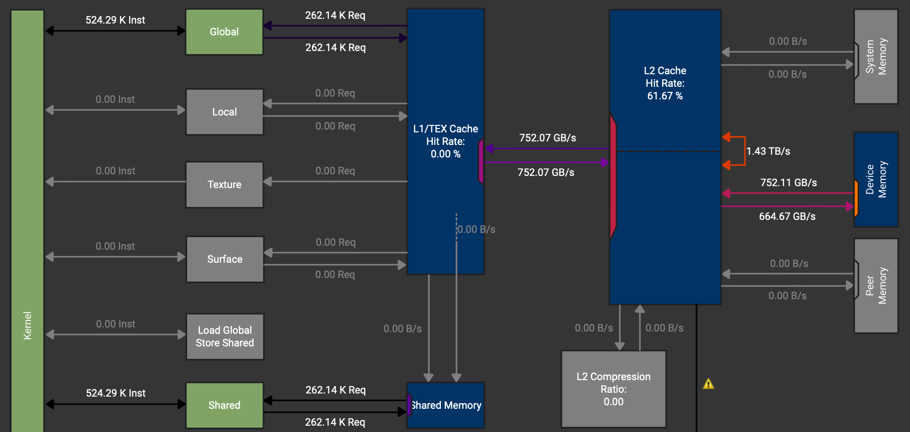
***Figure 8:** NCU memory chart of our vectorised copy example.*

We can also see that there is an instruction which should load directly to SMem (`Load Global Store Shared`) but it is not used. These instructions can be activated by using async copies on the A100.

#### Async Copy
The A100 chips have special hardware to perform async `GMem -> SMem` copies, which do not need to go through the registers. However, this only works to load data. Storing operations need to use different instructions. So for loading memory we can use the CuTe atoms `SM80_CP_ASYNC_CACHEGLOBAL` and for storing we again use vector instructions. We need to tweak the code slightly to be able to use two different copy instructions.
For the load copy instruction async copy with a 128 bit width (128 bit = 16 byte = 8 BF16 values) can be used. Then again we have the same mapping from threads to values as in the initial vectorised example.
```c
// Simple async copy that works: 128 threads, each thread copies 128 BF16
    TiledCopy copyA = make_tiled_copy(
        Copy_Atom<SM80_CP_ASYNC_CACHEGLOBAL<uint128_t>, bf16>{},
        Layout<Shape<_4, _8>, Stride<_8, _1>>{},  // 32 threads
        Layout<Shape<_1,_8>>{});     // Each copies 8 BF16
```
For the store copy instruction the same vectorised copy instruction is used. Due to no L2 caching on this data path, having 8 or 16 values per thread does not make a difference.
```c
// Regular copy for shared → global (Async not available)
    TiledCopy copyOut =  make_tiled_copy(
        Copy_Atom<AutoVectorizingCopyWithAssumedAlignment<128>, bf16>{},
        Layout<Shape<_4,_8>, Stride<_8,_1>>{},  
        Layout<Shape<_1,_8>>{});   
```
Lastly, we need to wait for the first copy to finish before we can issue the store back to GMem instruction. 
```c
cp_async_fence();
cp_async_wait<0>();
__syncthreads();
```

Using these async copy instructions gives a small improvement to 1.47 TB/s memory throughput and we can check that the data paths for the load instructions do no longer go over the registers.

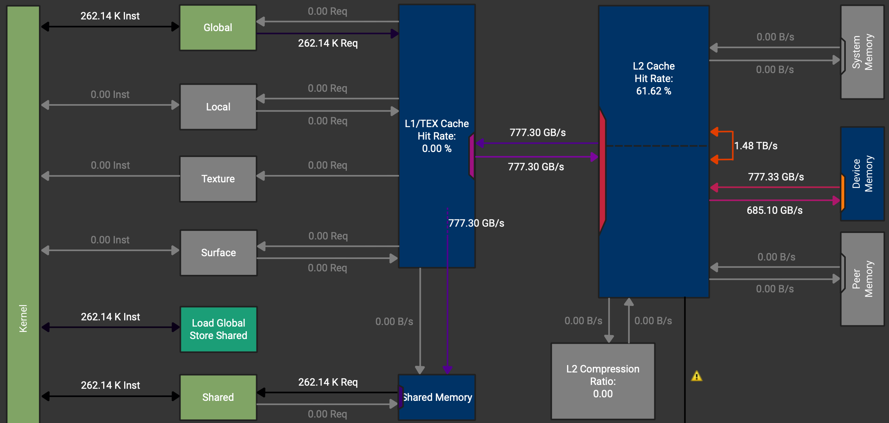
***Figure 9:** NCU memory chart of our async copy example showcasing direct loads to SMem.*

The next step usually would be to eliminate bank conflicts in the loads from shared memory. For exemplary purpose we will show this kernel. However, since we are bound by GMem bandwidth, this will not have a positive impact on the runtime in this kernel.

#### Swizzled Copy
In CUDA devices, shared memory is divided into equally-sized memory modules called "banks" that can be accessed simultaneously. A bank conflict occurs when multiple threads in a warp try to access different addresses that map to the same memory bank in the same clock cycle. This forces the accesses to be serialised, significantly reducing performance. Since physically each bank stores an adjacent 4 bytes in memory, using consecutive threads on consecutive memory addresses leads to bank conflicts. Little reminder here, that N-D arrays are serialised in memory, thus one can also have bank conflicts over the columns even if the layout is row-major.

How swizzling solves this: Swizzling rearranges how data is laid out in memory using bit manipulation (typically XOR operations) to distribute memory addresses across different banks. The key idea is to transform the addressing pattern so that threads that would normally conflict now access different banks.

(For further information I can recommend Alex Armbruster's [GEMM Tutorial](https://alexarmbr.github.io/2024/08/10/How-To-Write-A-Fast-Matrix-Multiplication-From-Scratch-With-Tensor-Cores.html#background-bank-conflicts-and-wavefronts), where he explains bank conflicts and swizzling with very nice illustrations.)

Drawing the banks for our shared memory currently looks something like this: 

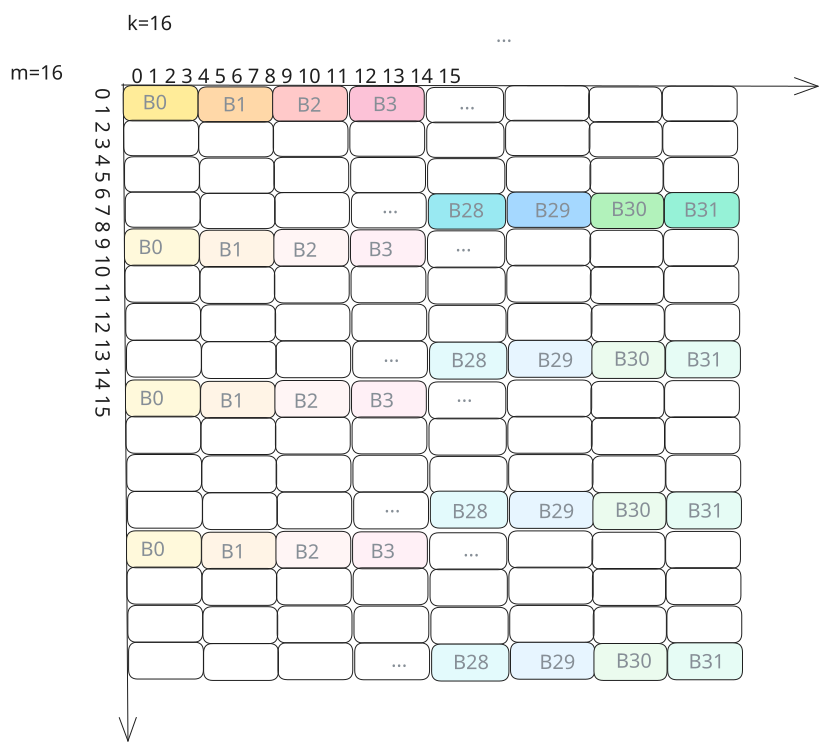
***Figure 10:** Matrix value to memory bank mapping before swizzling is applied.*

Again to our copy example managing these banks has very little impact because we are mainly concerned with the HBM bandwidth. However, for a GEMM they do much more, since the data is fetched from SMem and reused much more often. As explained in the next section in a bit more depth, there are many swizzling patterns. In our case we can use the standard 128-Bit swizzling pattern, which is designed to perfectly swizzle 128 byte wide tiles.

Now implementing swizzling is rather tedious in practice and one has to spend some time thinking through everything. With CuTe however, the changes are minimal. One just adds the swizzling pattern as a composition to the layout of the shared memory.
```c
// Swizzled shared memory layout
    auto sA = composition(
        Swizzle<2,3,3>{},                               // the swizzle transform
        make_layout(make_shape(Int<BM>{}, Int<BK>{}),   // the base (row-major) layout
                    make_stride(Int<BK>{}, Int<1>{})));
```

###### Swizzling
To define a good swizzling pattern, we need to take a look at the mma operation we want to be using later `mma.sync.aligned.m16n8k16.row.col.f32.bf16.bf16.f32` and it's corresponding thread layout and the matrix loading instruction involved. The following image is from the [PTX instructions](https://docs.nvidia.com/cuda/parallel-thread-execution/#warp-level-matrix-fragment-mma-16816-float). Another way to get the info is to print the mma atom in question.

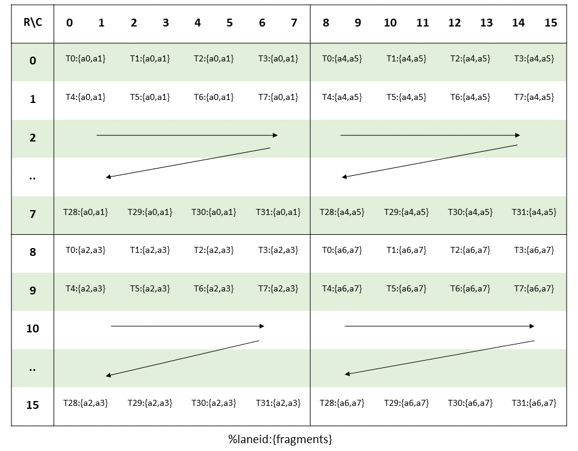
***Figure 11:** Illustration of the 16x8x16 BF16 mma instruction. [Source](https://docs.nvidia.com/cuda/parallel-thread-execution/#warp-level-matrix-fragment-mma-16816-float)*

To load the input matrices for this MMA instruction, the `ldmatrix.x4` or in CuTe the `SM75_U32x4_LDSM_N` copy atom can be used. This instruction loads a 16x16 tile from shared memory, which is exactly the tile size we have in our TC instructions. 

[Swizzle](https://docs.nvidia.com/cutlass/media/docs/pythonDSL/cute_dsl_api/cute.html#cutlass.cute.Swizzle) is defined by three parameters (`Swizzle<BBits,MBase,SShift>{}`): 
- MBase: The number of least-significant bits to keep constant 
- BBits: The number of bits in the mask 
- SShift: The distance to shift the mask

Since each thread is loading 4 consecutive bytes in each 8x8-subtile (4x8 threads), we need to swizzle these subtiles. As all the threads in one row hit unique banks, we can keep the order within each row constant. Thus we can set `MBase = 3 bits`. 

For `BBits`, we set it to 3 bits to handle the 8 rows in our 8×8 subtile. Since shared memory has 32 banks and uses bits [6:2] for bank indexing (with 4-byte bank width), we need to XOR 3 bits to create 8 distinct patterns (2³ = 8), ensuring each of the 8 rows in a subtile maps to a different set of banks. This prevents bank conflicts when all 32 threads in a warp simultaneously load from different rows.

Finally, `SShift = 3` specifies how far to shift before XORing. Each row in the subtile is 16 bytes wide (8 BF16 elements × 2 bytes), and we need to XOR the row information (bits above the 8-byte boundary) with the bank bits. With MBase=3 accounting for the lower 3 bits, shifting by 3 additional positions means we XOR bits [5:3] (which encode the row within a subtile) with bits from positions [8:6] and above. This creates a pattern where consecutive rows access different banks, achieving conflict-free loads across the entire warp.

Together, `Swizzle<3,3,3>{}` forms the standard 128-bit swizzling pattern, which distributes the 16×16 tile loaded by `ldmatrix.x4` across shared memory banks to eliminate bank conflicts.

With this simple intro to swizzling covered let's finish the Section on copying and move on the GEMMs.

#### Outlook: Hopper & Blackwell TMAs
From Hopper onwards, more weights was put on asynchronous copy operations by creating TMAs (Tensor Memory Accelerators). Using TMAs one can copy tiles directly between GMem and SMem. The setup using CuTe is similar but slightly extended to normal copy atoms. The official examples include 
```c
make_tma_atom(SM90_TMA_LOAD{}, A, As(_,_,0), make_shape(bM,bK));
```
More information can be found in the CUTLASS repo under `cutlass/include/cute/arch/copy_sm90_tma.hpp` and `copy_sm100_tma.hpp`.

---

# Conclusion & What's Next

In this first part, we've built a solid foundation in CuTe's layout algebra:

- **Layouts as functions**: The `(Shape, Stride)` tuple maps logical coordinates to physical memory offsets
- **Tiling with $\oslash$**: Logical division lets us partition tensors into hierarchical tiles
- **Composition with $\circ$**: Chaining layouts enables complex transformations like swizzling
- **Copy atoms**: Hardware-specific primitives that exploit async copy and vector instructions

We progressed from basic copy operations (1.33 TB/s) through vectorised and async copies to swizzled layouts on larger tiles (1.48 TB/s), while keeping the code declarative and maintainable.

But we've only scratched the surface. The real benefit are showcased when we apply these concepts GEMM kernels.


***Figure 13 (Preview):** In Part 2, we'll build a GEMM kernel that progressively improves from 102% to 116% of cuBLAS performance through 2-stage pipeliningg, L2 swizzling, and 3-stage pipelining.*

In [**Part 2: Building High-Performance GEMMs with CuTe**](CuTe%20Part%202%20-%20High-Performance%20GEMMs.md), we'll:
- Build a complete GEMM kernel from scratch using everything we learned here
- Implement 2-stage pipeliningg to overlap memory and compute
- Add L2 cache swizzling for better memory access patterns
- Push to 3-stage pipelining to exceed cuBLAS performance
- Port everything to the Python DSL for faster iteration

---

# Acknowledgments
A big thank you to [Verda](https://verda.com/) and [Paul](https://x.com/edchangy) for providing the compute for this blogpost, to [Szymon](https://x.com/SzymonOzog_) for cross-reading and guidance on how to benchmark properly, and to Lukas Bluebaum for helping me fix some stupid bugs in the code.

# Further Reading
- Docs [Nvidia](https://docs.nvidia.com/cutlass/media/docs/cpp/cute/00_quickstart.html)| [Github](https://github.com/NVIDIA/cutlass/blob/main/media/docs/cpp/cute)
- GPUMode [Lecture 15](https://www.youtube.com/watch?v=G6q719ck7ww) (Overview of CUTLASS, CuTe algebra)
- GPUMode [Lecture 57](https://www.youtube.com/watch?v=vzUhbDO_0qk) (Deep dive into CuTe with Cris Cecka.)
