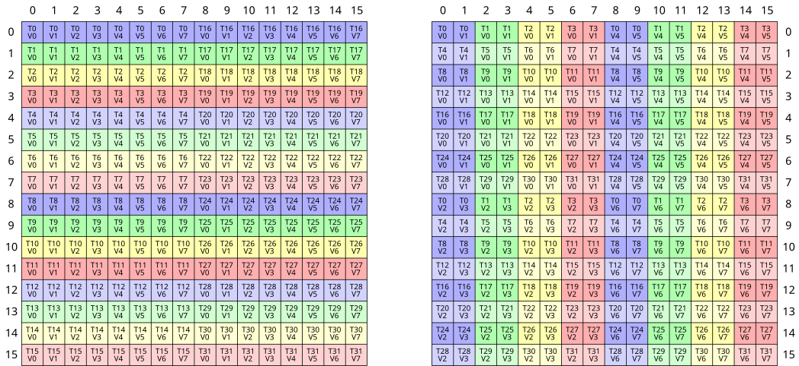
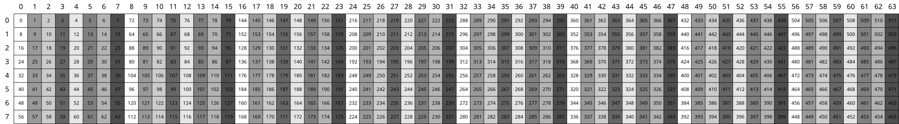
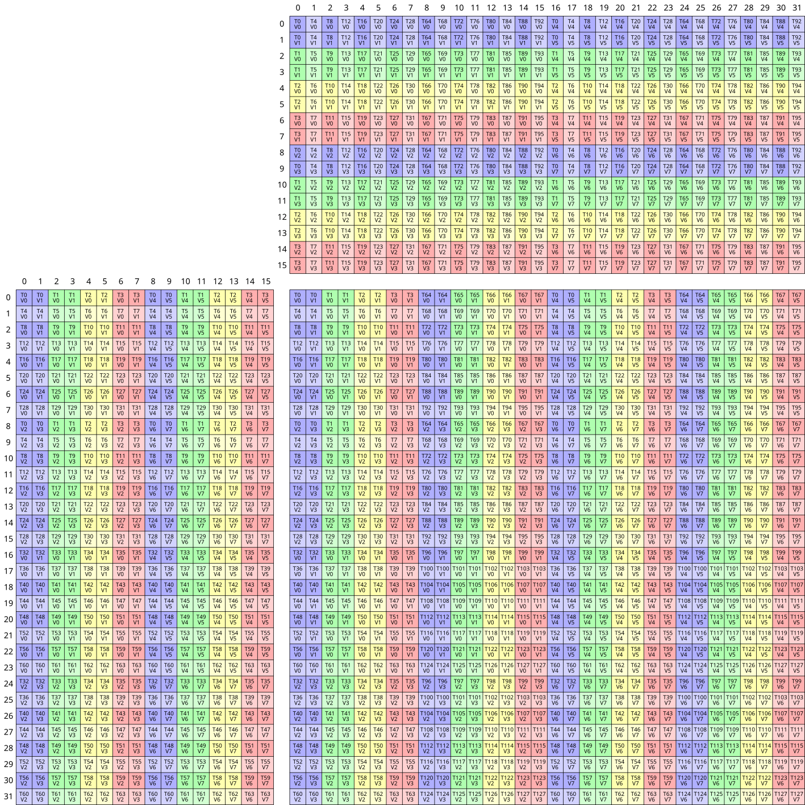
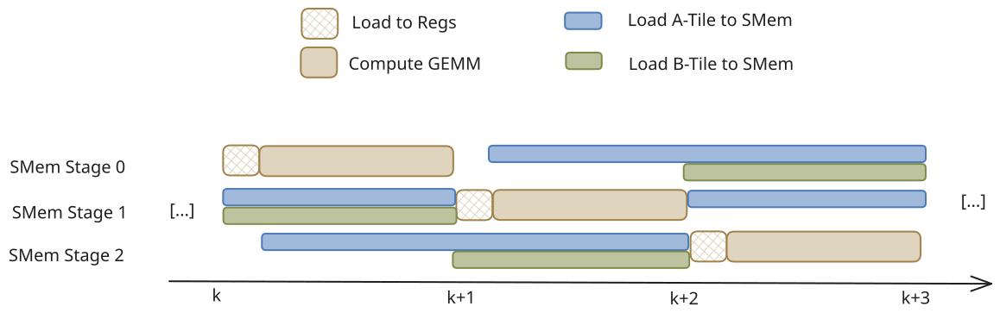
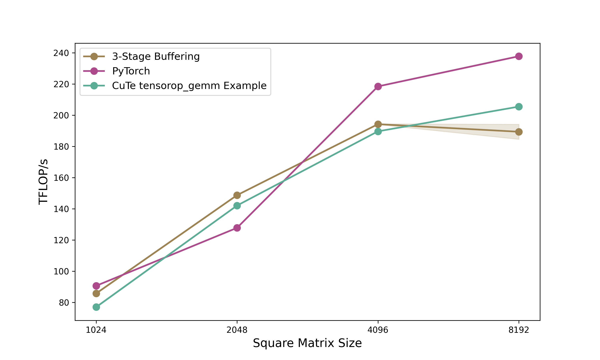

# Demystifying CuTe: Building High-Performance GEMMs
Or the sweet elysium when your mental model and the profiler agree.

*Part 2 of 2 — From copy kernels to fast matrix multiplication*

---

> **Series Overview:** This is the second of a two-part series on NVIDIA's CuTe (CUDA Template) library. [Part 1](https://schreibereric.substack.com/p/demystifying-cute-understanding-layout) covered the fundamentals: layout algebra, the CuTe API, and efficient copy operations. In this post, we apply those concepts to build a GEMM kernel that outperforms cuBLAS.

---

**TL;DR:** Using CuTe's layout algebra, we build a matrix multiplication kernel that progresses from 102% of cuBLAS performance (baseline) through double buffering (111%) and L2 swizzling (112%) to 3-stage pipelining (116%), all with clean, declarative code. We then port it to Python for faster iteration.

<figure style="text-align: center;">
  
  <figcaption><em><strong>Figure 1:</strong> Example copy from shared memory to registers in CuTe.</em></figcaption>
</figure>

## Quick Recap: CuTe Foundations

If you haven't read [Part 1](https://schreibereric.substack.com/p/demystifying-cute-understanding-layout), here's what you need to know:

**Layouts are functions.** A CuTe `Layout` is a `(Shape, Stride)` tuple that maps logical coordinates to physical memory offsets. For example, `(4,3):(3,1)` describes a 4×3 row-major matrix.

**Tiling with $\oslash$.** The logical division operator partitions tensors hierarchically:
$$(A,B,C) \oslash (a,b,c) = ((a,b,c),(A/a,B/b,C/c))$$

**Composition with $\circ$.** Layout composition chains transformations and is usefull to add swizzling to existing copy mechanisms.

**Copy/MMA Atoms.** Hardware-specific primitives (`TiledCopy`, `TiledMMA`) describe *how* threads cooperatively move and compute data, abstracting away PTX details.

With these tools, we built copy kernels achieving 1.48 TB/s on 128×64 tiles. Now let's tackle the real challenge: matrix multiplication.

---


With the layout algebra and copy kernels from Part 1 established, the natural question is whether CuTe's abstractions make kernels actually easier to code. There are some GEMM examples in the CUTLASS repo under `cutlass/examples/cute`, but these jump straight to heavily optimised implementations without explaining the reasoning behind each step. This post takes the same step-by-step approach as Part 1, progressively building out a minimal example, so you can follow my learning progress.

All examples can be found in full in this [repo](https://github.com/ericschreiber/DrowsyHummingbird). The goal is not to reach peak performance but to show how CuTe's layout algebra scales to a full GEMM kernel cleanly. I try to get the kernels as fast as reasonably possible, given some constraints (no block size optimisation; tile shape `128x128x64`; nicely aligned and sufficiently large matrices).

# CUDA CuTe Implementation

On newer server-grade GPUs (A100+) a simple GEMM can be conceptually thought in three steps: (1) Load tensor data, (2) perform tensor core operations and (3) write back the results. Therefore, we can use the code from the previous post as a base for the GEMM example. Again we will have a look at multiple GEMM examples. As will be demonstrated, given a base implementation using CuTe layouts, extending it with more concepts, like double buffering or L2 grid swizzling, does not require many changes. Let us commence with the simplest GEMM implementation using async copies.

## Base Implementation
First lets define the modus operandi aka the tiling of the problem. To swizzle perfectly we need that each thread hits a new bank. Each bank holds 4 bytes. Thus for perfect swizzling in K-major format, we need $K\geq32*4/2=64$ BF16 values. M and N should be chosen as large as possible as they are responsible for the reuse and thus the lowering of the IO-complexity and improving our GEMM speed. Thus we will start with the tile shape `128x128x64`. These tiles correspond to the output C matrix.

Each CTA (thread block) is responsible to compute such a tile and thus iterates over the K-dimension. To handle the swizzling effortlessly, we define the atom and compose it into our shared memory layout:
```c
// Define the swizzle atom
auto swizzled_128B_atom = composition(
    Swizzle<3,3,3>{},
    make_layout(
        make_shape(Int<8>{}, make_shape(Int<8>{}, Int<8>{})),
        make_stride(Int<8>{}, make_stride(Int<1>{}, Int<64>{})))
);

// Apply to Shared Memory A and B (128x64)
auto sA = tile_to_shape(swizzled_128B_atom, make_shape(Int<BM>{}, Int<BK>{}));
auto sB = tile_to_shape(swizzled_128B_atom, make_shape(Int<BN>{}, Int<BK>{}));
```

<figure style="text-align: center;">
  
  <figcaption><em><strong>Figure 2:</strong> Swizzled shared memory layout for A and B tiles.</em></figcaption>
</figure>

Inside the kernel, the execution flow is synchronous despite using async copy instructions (which was found in the previous post to be faster). We trigger a load, wait for it to complete, compute, and repeat. This creates a load-compute "stop-and-go" pattern.
```c
// Main MMA loop
for (int k = 0; k < (K + 64 - 1) / 64; k += 1) {
    // 1. Issue Async copy from global to shared
    copy(copyA, tAgA(_,_,_,k), tAsA);
    copy(copyB, tBgB(_,_,_,k), tBsB);
    
    // 2. Wait for data to arrive completely
    cp_async_fence();
    cp_async_wait<0>();
    __syncthreads();

    // 3. Load from Shared Memory to Registers
    copy(copyS2R_A, tXsA, tXrA);
    copy(copyS2R_B, tXsB, tXrB);

    // 4. Compute
    gemm(mma, tCrA, tCrB, tCrC);

    __syncthreads();
}
```

Two hardware primitives drive the compute and data-movement stages. The `SM80_16x8x16_F32BF16BF16F32_TN` atom maps to the `mma.sync.m16n8k16` tensor core instruction: a 16×8×16 matrix multiply with BF16 inputs and F32 accumulation. Tiling it 2×2 gives a 32×16×16 warp-level operation. For the shared memory → register transfers, `SM75_U32x4_LDSM_N` emits the `ldmatrix.x4` instruction: all 32 threads in a warp cooperate, each contributing one pointer, and the hardware loads four 8×8 tiles directly into the register layout the tensor core expects. `make_tiled_copy_A/B` derives the correct per-thread pointer mapping from the MMA layout automatically with no manual address arithmetic needed.
```c
TiledMMA mma = make_tiled_mma(SM80_16x8x16_F32BF16BF16F32_TN{},
                                 Layout<Shape<_2,_2>>{},    // 2x2x1 MMA Atoms
                                 Tile<_32,_32,_16>{});      // 32x32x16 Tiled MMA for LDSM

Copy_Atom<SM75_U32x4_LDSM_N, bf16> s2r_atom;
auto copyS2R_A = make_tiled_copy_A(s2r_atom, mma);
auto copyS2R_B = make_tiled_copy_B(s2r_atom, mma);
```

<figure style="text-align: center;">
  
  <figcaption><em><strong>Figure 3:</strong> MMA atom used for all compute operations in all of our GEMM kernels.</em></figcaption>
</figure>

One detour worth noting: I tried routing the write-back through shared memory; convert the F32 accumulators to BF16, write into shared memory, sync, then use a 128-bit tiled copy for a more bandwidth-efficient store to global. Having the expensive stores vectorized will offset the detour via SMem, right? It was slower. The problem is the layout mismatch forcing us via SMem. The MMA accumulator scatters elements across threads in the pattern the `m16n8k16` instruction produces, not in contiguous row-major chunks. The extra `__syncthreads()` and the round-trip cost more than the wider stores save. Direct `copy(tCrC, tCgC)` with each thread writing its accumulator slice straight to global, is simpler and cheaper.

*Disclaimer:* As everybody writing blogposts is doing we are looking at the optimal matrix size of our kernel. A more nuanced picture is shown in Figure 5.

Profiling this kernel on a matrix of size `2048x2048`, reveals that we already reach up to 101% of cuBLAS speed. Although I need to mention I chose this size specifically to get as close to cuBLAS as possible. Still not too bad for the first shot.
While this implementation effectively solves bank conflicts via the swizzled layout, the compute units (Tensor Cores) sit idle while waiting for memory, and the memory bus sits idle while the Tensor Cores are crunching. To fix this, we need to overlap these operations.

## Double Buffering
As you likely know, the load-wait-compute paradigm is suboptimal for modern GPUs. Instead, we want to load the _next_ tile of data while computing the _current_ tile. This requires us to double the allocation of our Shared Memory so we can write to one buffer (Stage 1) while reading from the other (Stage 0).

In CuTe, implementing this is surprisingly elegant. We simply add a pipeline stage dimension to our shared memory layout. (And we need to make sure not to mess up the other dimensions swizzling pattern.)
```c
// Previous: make_shape(Int<BM>{}, Int<BK>{})
// New:      Add a 3rd dimension for stages
auto sA = tile_to_shape(swizzled_128B_atom, make_shape(Int<BM>{}, Int<BK>{}, Int<2>{}));
auto sB = tile_to_shape(swizzled_128B_atom, make_shape(Int<BN>{}, Int<BK>{}, Int<2>{}));
```

However, a small caveat arises when allocating registers. Since `sA` is now Rank-3 (M, K, Stage), naive partitioning would create Rank-3 register fragments. Registers don't need stages. They just hold the values for the math. We fix this by slicing the layout to create a "template" for the register allocation:
```c
// Slice 0 to remove the stage dimension for register allocation
Tensor tCrA = thr_mma.partition_fragment_A(sA(_,_,0)); 
Tensor tCrB = thr_mma.partition_fragment_B(sB(_,_,0)); 
```

The algorithm changes from a simple loop to a Prologue + Loop structure. The prologue is to "prime the pump" by loading the first tile before entering the loop.

1. The Prologue:

We issue the load for $k=0$, commit the async group, and wait for it.
```c
// PROLOGUE: Load k=0 into smem_write stage
copy(copyA, tAgA(_,_,_,0), tAsA(_,_,_,smem_write));
copy(copyB, tBgB(_,_,_,0), tBsB(_,_,_,smem_write));
cp_async_fence();

// Flip write stage
smem_write = (smem_write + 1) % 2;

// Wait for k=0 to arrive so we can start computing
cp_async_wait<0>();
__syncthreads();
```

2. The Pipelined Loop:

Inside the main loop, we compute the current data while simultaneously issuing loads for the next tile. Note that in the provided code, we also tile the Register loads (Looping over K_BLOCK_MAX) to further hide shared memory latency, but the high-level logic for double buffering remains:
```c
for (int k = 0; k < k_tile_max; k++) {
    // ... inner loop over register blocks ...
    
    // If we are at the start of a tile, issue Global Load for NEXT tile (k+1)
    if (k_block == 0 && k_tile_next < k_tile_max) {
         copy(copyA, tAgA(_,_,_,k_tile_next), tAsA(_,_,_,smem_write));
         copy(copyB, tBgB(_,_,_,k_tile_next), tBsB(_,_,_,smem_write));
         cp_async_fence();
         
         // Flip the write stage index
         smem_write = (smem_write + 1) % 2;
         k_tile_next++;
    }

    // Perform Math on the data we waited for in the previous step/prologue
    gemm(mma, tCrA(_,_,k_block), tCrB(_,_,k_block), tCrC);

    // If we are done with the current tile, flip the read stage and wait for the load we issued above
    if (k_block == K_BLOCK_MAX - 1) {
        smem_read = (smem_read + 1) % 2;
        cp_async_wait<0>();
        __syncthreads();
    }
}
```

By manually managing `smem_write` and `smem_read` indices, we ensure the Async Copy engine is filling one stage while the Tensor Cores are consuming the other. This mostly hides the global memory latency (assuming the compute takes longer than the load), resulting in a good bandwidth jump closer to the hardware limit, which brings us up to 111% of cuBLAS.

## L2 Cache Swizzle
Even with efficient double buffering, we might still hit a performance ceiling due to a phenomenon called Partition Camping.

When we launch a kernel, CUDA typically assigns thread blocks (CTAs) in a raster-scan order (increasing X, then increasing Y). Since `A` and `B` matrices are large row-major or column-major contiguous blocks, adjacent thread blocks often access memory addresses that map to the same L2 cache partitions. This causes high contention on specific memory controllers while others sit idle.

To fix this, we need to again swizzle the order in which thread blocks consume the tiles. Instead of processing row-by-row, we process in a blocked pattern. This distributes memory accesses more evenly across the memory partitions and increases the likelihood that the data required by a new block is already resident in the L2 cache.

In our kernel, this logic sits right at the top. We detach the physical grid coordinates (`blockIdx`) from the logical problem coordinates (`m_idx`, `n_idx`).
```c
// 1. GRID SWIZZLING (Optimized L2 Cache Access)
    int m_idx = blockIdx.x;
    int n_idx = blockIdx.y;

    // Swizzle Factor: 8 works well for 128x128 on A100 (matches L2 slice width)
    constexpr int swizzle_factor = 8; 
    
    if (gridDim.x >= swizzle_factor) {
        // Flatten the grid to a linear ID
        int tid = blockIdx.x + blockIdx.y * gridDim.x;
        
        int idx_outer = tid / swizzle_factor;
        int idx_inner = tid % swizzle_factor;
        
        int m_grid = gridDim.x;
        
        // Re-calculate coordinates to form a "Z" curve
        int n_swizzled = idx_outer / ((m_grid + swizzle_factor - 1) / swizzle_factor);
        int m_swizzled = (idx_outer % ((m_grid + swizzle_factor - 1) / swizzle_factor)) * swizzle_factor + idx_inner;

        // Bounds check
        if (m_swizzled < m_grid) {
             m_idx = m_swizzled;
             n_idx = n_swizzled;
        }
    }
```

The beauty of CuTe is that this coordinate transformation is completely decoupled from the tiling logic. Once we have the new `m_idx` and `n_idx`, we simply create the coordinate object:
```c
    // Use the swizzled coordinates for the CTA Tile
    auto cta_coord = make_coord(m_idx, n_idx, _);
```

The rest of the kernel (loading `gA_tile`, `gB_tile`, and partitioning) remains exactly the same. We have fundamentally changed the execution order across the device to optimize hardware utilization without needing to rewrite a single line of the math or copy logic. This improves the execution speed slightly to up to 112% of cuBLAS.

## 3-Stage Buffering
While double buffering allows us to overlap current computation with the _next_ memory load, it creates a tight dependency: the compute time for the current tile must be strictly longer than the load time for the next tile. If the global memory is momentarily congested or the compute is too fast, the pipeline bubbles.

To make the pipeline more robust, we move to 3-Stage Buffering. Instead of "Load Next, Compute Current," we aim for "Load Next-Next, Load Next, Compute Current." This creates a deeper reservoir of ready data, smoothing out jitter in memory arrival times.

<figure style="text-align: center;">
  
  <figcaption><em><strong>Figure 4:</strong> Visualization of the 3-stage pipelining.</em></figcaption>
</figure>

In CuTe, the transition from 2 to 3 stages is structurally simple but conceptually nuanced regarding synchronization.
First, we expand our Shared Memory allocation. We are now allocating 50% more shared memory than before:
```cpp
// Previous: make_shape(Int<BM>{}, Int<BK>{}, Int<2>{})
// New:      Using 3 stages
constexpr int STAGES = 3;
auto sA = tile_to_shape(swizzled_128B_atom, make_shape(Int<BM>{}, Int<BK>{}, Int<STAGES>{}));
auto sB = tile_to_shape(swizzled_128B_atom, make_shape(Int<BN>{}, Int<BK>{}, Int<STAGES>{}));
```

The algorithm complexity increases significantly in the Prologue. Because we need to be computing `k` while loading `k+2`, the pipeline isn't ready to run until we have *two* tiles already in flight.
```cpp
// PROLOGUE: Prefetch first (STAGES - 1) k-tiles
// For 3-stage, we load k=0 and k=1 before entering the loop
for (int k_tile = 0; k_tile < STAGES - 1; k_tile++) {
    copy(copyA, tAgA(_,_,_,k_tile_index), tAsA(_,_,_,k_tile));
    copy(copyB, tBgB(_,_,_,k_tile_index), tBsB(_,_,_,k_tile));
    
    k_tile_index++;
    // Commit the async copy group
    cp_async_fence(); 
}
```

In double buffering, we used `cp_async_wait<0>`, which means "Wait until 0 operations are pending" (i.e., wait for everything to finish). In 3-stage buffering, we maintain multiple copy groups in flight. We don't need all of them to finish; we only need the oldest one (the one we are about to compute on) to finish.
```cpp
// We have STAGES in flight. We need the oldest one ready.
// So we wait until only (STAGES - 2) groups are left pending.
cp_async_wait<STAGES - 2>();
__syncthreads();
```

Inside the loop, the logic shifts to looking two steps ahead:
```cpp
// 1. Issue Global Load for k+2 (The "Next-Next" tile)
// We write to smem_write, which is cyclically 2 steps ahead of smem_read
if (k_tile + STAGES - 1 < k_tile_max) {
    copy(copyA, tAgA(_,_,_,k_tile_index), tAsA(_,_,_,smem_write));
    copy(copyB, tBgB(_,_,_,k_tile_index), tBsB(_,_,_,smem_write));
    cp_async_fence();
    
    // Advance pointers
    smem_write = (smem_write + 1) % STAGES;
    smem_read  = (smem_read  + 1) % STAGES;
}

// 2. Compute on the oldest tile (k) which we just waited for
gemm(mma, tCrA(_,_,k_block), tCrB(_,_,k_block), tCrC);
```

#### The Trade-off:
3-Stage buffering is not a "free lunch." It is harder to get right because it increases the Shared Memory requirement per block.

On NVIDIA GPUs, Occupancy (the number of active warps per SM) is often limited by Shared Memory capacity. If moving from 2 stages to 3 stages pushes the block size over a threshold (e.g., from 48KB to 72KB), the GPU might be forced to run fewer thread blocks simultaneously on an SM (In our case from 3 to 2). If the occupancy drops too low, the ability to hide memory loads and other latencies via thread switching degrades, negating the benefit of the deeper pipeline.

However, for large matrix sizes (e.g., 2048x2048), the improved overlap outweigh the reduced occupancy. In our benchmarks, this 3-stage implementation pushes performance further, reaching 116% of cuBLAS.

## General Benchmarking
To be honest, I targeted `2048x2048` specifically, as cuBLAS performance seems to be worst there. While my kernel generally tracks closely with the library, the specific lead at 2048 is more likely due to them underperforming rather than to my ingenuity. Regardless, it is satisfying to demonstrate that exceeding vendor-tuned performance on realistic sizes is still achievable years into the A100's lifecycle.

<figure style="text-align: center;">
  
  <figcaption><em><strong>Figure 5:</strong> Our kernel performances compared to cuBLAS on different matrix sizes. As indicated due to how the tiling shape was chosen, our kernels work best for square matrices of size `2048x2048`.</em></figcaption>
</figure>

#### Next Steps
Comparing my implementation to the cuBLAS SASS disassembly reveals two key differences. First, our tiling strategies diverge slightly. Second, we use different asynchronous copy instructions: I employ `SM80_CP_ASYNC_CACHEALWAYS` (writing into L2 and L1), while cuBLAS utilises `SM80_CP_ASYNC_CACHEGLOBAL`, which bypasses L1 to reduce cache pollution. Currently, my implementation relies on L1 hits for performance, so blindly switching to the bypass instruction degrades throughput without a corresponding layout adjustment.

Going forward, further optimisations would include:
- Refining Tiling: Experimenting with tile dimensions to better match the specific cache hierarchy of the A100.
- Hopper (H100): Adapting the pipeline to utilise the Tensor Memory Accelerator (TMA), which hardware-accelerates the asynchronous copy and tiling logic. Applying the TMA to all input matrix sizes however, is not optimal. Computing the handle can take more registers and time than computing the indices needed for I/O operations.
- Blackwell (B200): Leveraging the new Tensor Memory features.

So far we've implemented everything in CUDA C++. But NVIDIA now offers an alternative: a Python DSL that compiles to the same efficient code. Let's see how our 3-stage kernel translates.

# CuTe Python DSL 
NVIDIA is increasingly moving towards higher-level abstractions backed by strong compilers. While C++ remains the gold standard for absolute control (offering direct PTX assembly integration and granular compilation management), the CuTe Python DSL offers a compelling alternative.

Python has improved in developer speed: it offers faster compilation for small projects using JIT, simpler scaffolding with PyTorch integration, and seamless integration with standard Python debuggers and profilers. C++, conversely, retains the edge when you need to use inline assembly or require complex build system integration. Crucially, as we will see, Python's convenience does not come at the cost of speed anymore.

This section examines the complete 3-stage pipelined GEMM kernel, developed in the previous section, ported from CUDA to Python, comparing implementation approaches and measuring performance differences.

**Type Declarations and Kernel Definition**
Where CUDA requires template parameters throughout the type system:
```cpp
template <class ProblemShape, class CtaTiler, 
          class StrideA, class SmemLayoutA, ...>
__global__ void kernelCuteSwizzledPipeline3StageOptimized(
    ProblemShape problem_shape, CtaTiler cta_tiler,
    bf16 *A, StrideA a_stride, SmemLayoutA a_smem_layout,
    ...)
```

The Python DSL uses runtime objects with a decorator:
```python
@cute.kernel
def gemm_kernel(
    mA: cute.Tensor,
    mB: cute.Tensor,
    mC: cute.Tensor,
    sA_layout: cute.ComposedLayout,
    sB_layout: cute.ComposedLayout,
    ...
):
```

The `@cute.kernel` decorator handles JIT compilation to CUDA C++, generating template instantiations automatically. This eliminates template metaprogramming while preserving compile-time optimisations.

**Layout Construction**
Swizzled shared memory layouts demonstrate the syntactic transformation. The CUDA version composes template types:
```cpp
auto swizzled_128B_atom = composition(
    Swizzle<3,3,3>{},
    make_layout(
        make_shape(Int<8>{}, make_shape(Int<8>{}, Int<8>{})),
        make_stride(Int<8>{}, make_stride(Int<1>{}, Int<64>{})))
);
```

Python expresses the same layout through nested tuples:
```python
layout_atom_outer = cute.make_layout(
    (8, (8, 8)),
    stride=(8, (1, 64)),
)
swizzle = cute.make_swizzle(3, 3, 3)
swizzle_atom = cute.make_composed_layout(swizzle, 0, layout_atom_outer)
```

Both encode an 8×64 layout atom with hierarchical structure, but nested tuples read more like mathematical notation than type algebra. The semantic meaning remains identical, while the syntax in my opinion becomes more accessible.

**Tensor Partitioning and Indexing**
The core partitioning API remains nearly unchanged. Both versions use identical method names:
```cpp
// CUDA
auto thr_copy_a = copyA.get_thread_slice(threadIdx.x);
auto tAgA = thr_copy_a.partition_S(gA_tile);  // Source
auto tAsA = thr_copy_a.partition_D(sA);       // Destination
```

```python
# Python
thr_copy_A = tiled_copy_A.get_slice(tidx)
tAgA = thr_copy_A.partition_S(gA)  # (CPY, CPY_M, CPY_K, k_tiles)
tAsA = thr_copy_A.partition_D(sA)  # (CPY, CPY_M, CPY_K, STAGES)
```

The partition operations create per-thread tensor views. However, tensor indexing reveals the most visible syntactic difference:
```cpp
copy(copyA, tAgA(_,_,_,k_tile_index), tAsA(_,_,_,k_tile));
```

```python
cute.copy(tiled_copy_A, tAgA[None, None, None, k_tile_index], 
          tAsA[None, None, None, k_tile])
```

CUDA uses `_` to select entire dimensions, while Python uses `None`. This aligns with NumPy's broadcasting convention, making the syntax familiar to scientific Python users. Both represent the same operation: selecting all elements along the first three modes while indexing the fourth.

Memory management abstractions differ substantially. CUDA requires manual pointer arithmetic:
```cpp
extern __shared__ char smem_[];
bf16* smem_ptr = reinterpret_cast<bf16*>(smem_);
Tensor sA = make_tensor(make_smem_ptr(smem_ptr), a_smem_layout);
Tensor sB = make_tensor(make_smem_ptr(smem_ptr + cosize_v<SmemLayoutA>), 
                        b_smem_layout);
```

Python introduces an allocator that handles offsets automatically:
```python
smem = cutlass.utils.SmemAllocator()
sA = smem.allocate_tensor(io_dtype, sA_layout, 128)
sB = smem.allocate_tensor(io_dtype, sB_layout, 128)
```

The allocator computes byte offsets, manages alignment, and returns typed tensor views. 

**The Main Pipeline**
The 3-stage pipeline logic translates directly between languages. Both implementations prefetch the first two tiles in a prologue:
```cpp
// CUDA Prologue
for (int k_tile = 0; k_tile < num_smem_stages - 1; k_tile++) {
    if (k_tile < k_tile_max) {
        copy(copyA, tAgA(_,_,_,k_tile_index), tAsA(_,_,_,k_tile));
        copy(copyB, tBgB(_,_,_,k_tile_index), tBsB(_,_,_,k_tile));
    }
    k_tile_index++;
    cp_async_fence();
}
```

```python
# Python Prologue
for k_tile in range(num_smem_stages - 1):
    if k_tile < k_tile_max:
        cute.copy(tiled_copy_A, tAgA[None, None, None, k_tile_index], 
                  tAsA[None, None, None, k_tile])
        cute.copy(tiled_copy_B, tBgB[None, None, None, k_tile_index], 
                  tBsB[None, None, None, k_tile])
        k_tile_index = k_tile_index + 1
    arch.cp_async_commit_group()
```

And also the main loop structure remains consistent. On the first k-block of each tile, issue global loads for the next tile. Before each computation, prefetch register data for the next k-block:
```python
for k_tile in range(k_tile_max):
    for k_block in cutlass.range_constexpr(k_block_max):
        if k_block == k_block_max - 1:
            smem_read_current = smem_read
            arch.cp_async_wait_group(num_smem_stages - 2)
            arch.sync_threads()
        
        # Prefetch next k-block to registers
        next_k_block = (k_block + 1) % k_block_max
        cute.copy(tiled_copy_s2r_A, 
                  tCsA_copy_view[None, None, next_k_block, smem_read_current],
                  tCrA_copy_view[None, None, next_k_block])
        
        if k_block == 0:
            # Issue global load for next tile
            if k_tile + num_smem_stages - 1 < k_tile_max:
                cute.copy(tiled_copy_A, tAgA[None, None, None, k_tile_index],
                          tAsA[None, None, None, smem_write])
        
        # Compute with current data
        cute.gemm(tiled_mma, tCrC, tCrA[None, None, k_block], 
                  tCrB[None, None, k_block], tCrC)
```

The Python version uses `cutlass.range_constexpr()` for loop unrolling, replacing `#pragma unroll` with an explicit API call. The pipeline state management (tracking `smem_read`, `smem_write`, and `k_tile_index`) follows identical logic in both languages.

## Performance Analysis
Benchmark results from NCU for 2048×2048 BFloat16 matrices show the 3-stage pipeline kernel achieves 149 TFLOPS compared to PyTorch's 128 TFLOPS (116% relative performance) and NVIDIA's own Python CuTe DSL example at 142 TFLOPS (105% relative). The Python CuTe DSL kernel runs in 0.1155ms versus approximately 0.1158ms for equivalent CUDA code. So essentially we achieve the same performance as the CUDA version.

This performance parity occurs because the Python DSL should compile to identical CUDA code through JIT compilation.

<figure style="text-align: center;">
  
  <figcaption><em><strong>Figure 6:</strong> Our 3-stage pipeline kernel ported to Python CuTe DSL compared to standard PyTorch (using cuBLAS under the hood) and NVIDIAs own Python CuTe DSL example. Again our kernel works best for square matrices of size `2048x2048`.</em></figcaption>
</figure>

---

# Conclusion

This two-part series demonstrated CuTe's layout algebra and how to use them in CUDA kernels and their Python DSL counterparts. Looking at CuTe's layout algebra we started from the fundamental `(Shape, Stride)` tuples to tiling (`⊘`) and composition (`∘`), showcasing that in theory it is a powerful abstraction for avoiding indexing errors in GPU kernels. We progressively optimized memory copies from basic implementations to swizzled async copies. Based on these copy kernels we then built a GEMM kernel progressing from 101% of cuBLAS (baseline) through double buffering (111%) and L2 swizzling (112%) to 3-stage pipelining (116%) on 2048×2048 matrices. The CuTe layout abstractions made the code clean and helped us build the GEMM kernel in a declarative way without loosing performance. Additionally, we were able to port the entire kernel to Python with near-identical performance, and showcasing faster execution times than the CuTe Python example provided by NVIDIA on most matrix sizes.

**When to Use CuTe.** Use **cuBLAS/cuDNN** for standard operations where their tuning excels. Reach for **CuTe** when building for example custom fused kernels, novel architectures (attention variants, state-space models), or rapidly iterating on tiling strategies. Its layout algebra makes partitioning explicit and composable. Highly specialized kernels may still benefit from hand-tuned CUDA, though I have not seen an example of this requirement yet.

**Python DSL.** The Python CuTe DSL reduces our 850-line CUDA kernel to ~650 lines while achieving near-identical performance through JIT compilation. Python offers faster iteration (much shorter compilation overhead), seamless PyTorch integration, and standard tooling (debuggers, profilers, Jupyter). C++ retains advantages for direct PTX control and existing CUDA codebases. Both implementations matching cuBLAS validates the underlying abstractions. The choice between languages becomes one of development context rather than performance capability.

---

# Acknowledgments
A big thank you to [Verda](https://verda.com/) and [Paul](https://x.com/edchangy) for providing the compute for this blogpost and to [Szymon](https://x.com/SzymonOzog_) for cross-reading and guidance on how to benchmark properly, and to [Lukas](https://x.com/LukasBluebaum) for helping me fix some stupid bugs in the code.


# Further Reading
- Docs [Nvidia](https://docs.nvidia.com/cutlass/media/docs/cpp/cute/00_quickstart.html)| [Github](https://github.com/NVIDIA/cutlass/blob/main/media/docs/cpp/cute)
- GPUMode [Lecture 15](https://www.youtube.com/watch?v=G6q719ck7ww) (Overview of CUTLASS, CuTe algebra)
- GPUMode [Lecture 57](https://www.youtube.com/watch?v=vzUhbDO_0qk) (Deep dive into CuTe with Cris Cecka.)
- [Part 1: Understanding CuTe Layouts](https://schreibereric.substack.com/p/demystifying-cute-understanding-layout) — The foundation for everything in this post
