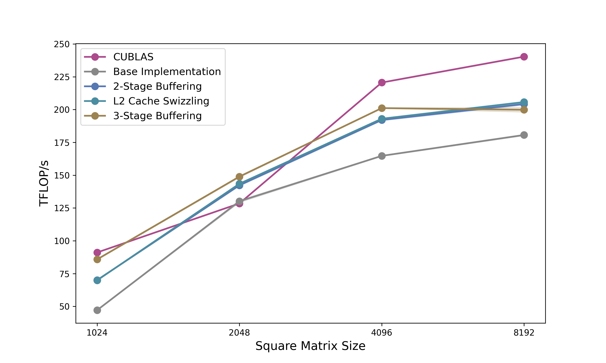

# Demystifying CuTe: Understanding Layout Algebra and Writing a Fast GEMM from Scratch

This repository contains the kernels, as described in the the two blogposts: [Demystifying CuTe: Understanding Layout Algebra](https://schreibereric.substack.com/p/demystifying-cute-understanding-layout) and [Demystifying CuTe: How to Write a Fast GEMM from Scratch](https://schreibereric.substack.com/p/demystifying-cute-how-to-write-a).

The idea is to understand the CuTe library and explain intermediate level concepts in CUDA programming with it. The final mm kernels outperform cuBLAS for square matrices of size 2048 on A100 80GB GPUs.

<div align="center">
	
</div>

## Hardware Requirements

Currently only for NVIDIA A100 GPUs.

## Submodules

This repository includes an external dependency added as a git submodule:

- `third_party/cutlass` — NVIDIA CUTLASS (https://github.com/NVIDIA/cutlass). This is added as a submodule to keep the third-party code separate from the project source. Initialize and update the submodule with:

```bash
git submodule update --init --recursive
```

If you clone this repository for the first time, consider cloning with `--recurse-submodules` to fetch CUTLASS automatically:

```bash
git clone --recurse-submodules <repo-url>
```

## Copy Kernels

Copy kernels are located in the `copy/` directory. To build and run:

```bash
# Build and run copy benchmarks
make copy_bench && ./out/copy_bench

# Build and run with profiling
make copy_profile
```

## Matrix Multiplication Kernels

Matrix multiplication kernels are located in the `matmuls/` directory. To build and run:

```bash
# Build and run matrix multiplication benchmarks
make matmul_bench && ./out/matmul_bench

# Build and run with profiling
make matmul_profile
```

## Profiling

Profiling traces of all kernels on A100 80GB are available in the `profiling/` directory. 
Clocks were set to maximum for profiling with:

```bash
nvidia-smi -pm 1
nvidia-smi -ac 1593,1410
```

## Python Setup

Python dependencies are managed with [uv](https://github.com/astral-sh/uv). 

### Install uv

```bash
curl -LsSf https://astral.sh/uv/install.sh | sh
```

### Running the CUTE DSL

To run the Python-based CUTE DSL implementation:

```bash
uv run python matmuls/cute_mma_matmul_3stage_pip_grid_swizzle_dsl.py
```

To run its profiles run

```bash
make python_profile
```


# Citation
```bibtex
@misc{schreiber2026demystifying_cute,
  author       = {Schreiber, Eric},
  title        = {Demystifying CuTe: Understanding Layout Algebra and Writing a Fast GEMM from Scratch},
  year         = {2026},
  url          = {https://github.com/ericschreiber/DrowsyHummingbird},
  note         = {Blog post series on NVIDIA CuTe library and CUDA programming},
}
```